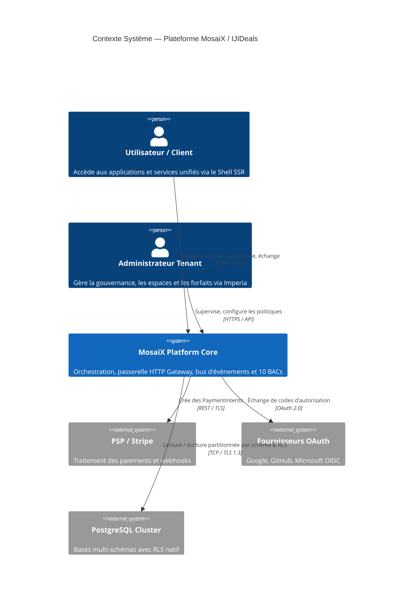
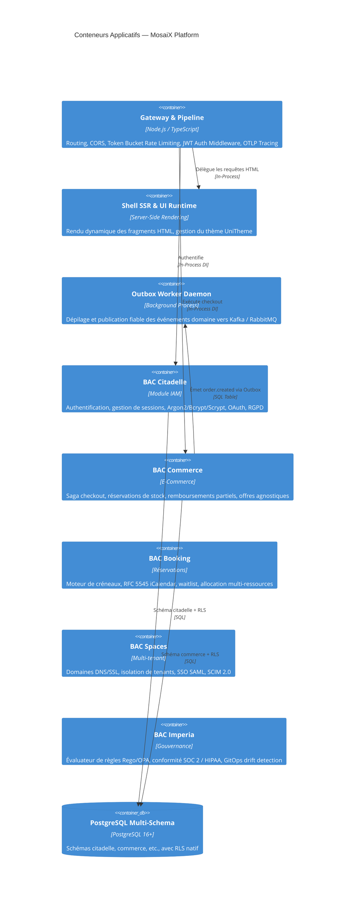

# MosaiX Ops Runbooks & Architecture C4

Date : 2026-09-23  
Statut : Documenté & Approuvé

---

## 1. Diagrammes d'Architecture C4 (Mermaid)

### Niveau 1 : Contexte Système (System Context)

### Niveau 2 : Conteneurs Applicatifs (Container Diagram)

---

## 2. Runbooks Opérationnels (Incident Response & Procedures)

### RUNBOOK-01 : Migration Zero-Downtime Schéma PostgreSQL
1. **Étape 1 — Création des schémas cibles** :
   Exécuter `CREATE SCHEMA IF NOT EXISTS "<bac>";` pour chacun des BACs sans impact sur le trafic.
2. **Étape 2 — Bascule des tables (Atomic move)** :
   Exécuter `ALTER TABLE "public"."<bac>_<table_name>" SET SCHEMA "<bac>";` suivi de `ALTER TABLE "<bac>"."<bac>_<table_name>" RENAME TO "<table_name>";`.
3. **Étape 3 — Rétro-compatibilité via Vues (Synonymes)** :
   Créer une vue temporaire dans `public` si des clients historiques requièrent l'ancien nom :
   `CREATE VIEW "public"."<bac>_<table_name>" AS SELECT * FROM "<bac>"."<table_name>";`.
4. **Étape 4 — Validation et rollback** :
   En cas d'anomalie, ré-exécuter `ALTER TABLE "<bac>"."<table_name>" SET SCHEMA "public";`.

### RUNBOOK-02 : Incident Sécurité SEV1 — Brute-Force ou Fuite de Session
1. **Étape 1 — Verrouillage du compte** :
   Invoquer `AccountLockoutGuard.recordFailure(userId)` pour geler les accès pendant 15 minutes.
2. **Étape 2 — Révocation de la famille de jetons de rafraîchissement** :
   Appeler `SessionTokenManager.revokeFamily(familyId)` pour invalider instantanément tous les refresh tokens associés.
3. **Étape 3 — Invalidation du cache de session Redis** :
   Exécuter `DEL session:token:<hash>` sur l'instance Redis active.
4. **Étape 4 — Audit des logs** :
   Consulter les traces OTLP pour extraire l'adresse IP et les requêtes associées.
